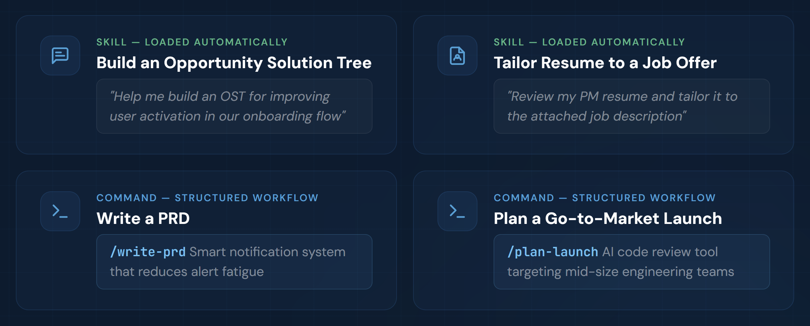

[](https://github.com/phuryn/pm-skills/blob/main/LICENSE)
[](https://github.com/phuryn/pm-skills/blob/main/CONTRIBUTING.md)

# PM 技能市场 (PM Skills Marketplace)：助你做出更好产品决策的 AI 操作系统

> 涵盖 8 个插件、65 项 PM 技能和 36 个链式工作流。支持 Claude Code、Cowork 等。从发现、策略、执行到发布和增长，全方位覆盖。


专为 Claude Code 和 Cowork 设计。技能同样兼容其他 AI 助手。

## 从这里开始

新想法？ → `/discover`  
需要战略清晰度？ → `/strategy`  
正在编写 PRD？ → `/write-prd`  
规划产品发布？ → `/plan-launch`  
定义核心指标？ → `/north-star`

如果这个项目对你有帮助，请给仓库点个 ⭐。

## 为什么选择 PM 技能市场？

通用的 AI 只给你文字。PM 技能市场给你结构。

每项技能都编码了经过验证的 PM 框架——发现、假设映射、优先级排序、策略——并引导你逐步完成。你将把 Teresa Torres、Marty Cagan 和 Alberto Savoia 的严谨性融入日常工作流，而不仅仅是让它们躺在书架上。

结果是：做出更好的产品决策，而不仅仅是更快地生成文档。

## 它是如何运作的（技能、命令、插件）

**技能 (Skills)** 是市场的构建基块。每项技能都赋予 Claude 特定 PM 任务的领域知识、分析框架或引导式工作流。一些技能还作为多个命令共享的可重用基础。

当与对话相关时，技能会自动加载——无需显式调用。如果需要（例如，优先使用技能而非通用知识），你可以使用 `/插件名:技能名` 或 `/技能名`（Claude 会自动添加前缀）来**强制加载技能**。

**命令 (Commands)** 是用户通过 `/命令名` 触发的工作流。它们将一个或多个技能链接成端到端的流程。例如，`/discover` 链接了四个技能：brainstorm-ideas → identify-assumptions → prioritize-assumptions → brainstorm-experiments。

**插件 (Plugins)** 将相关的技能和命令组合成可安装的包。每个插件覆盖一个 PM 领域——发现、策略、执行等。安装市场将同时获得所有 8 个插件。



命令使用技能。一些技能服务于多个命令。一些技能（如 `prioritization-frameworks` 或 `opportunity-solution-tree`）是 Claude 在相关时随时调用的独立参考——无需命令。

命令设计为相互衔接，匹配 PM 的工作流程。任何命令完成后，它都会建议相关的后续命令——只需跟随提示操作即可。

## 安装

### Claude Cowork（推荐非开发者使用）

1. 打开 **Customize**（左下角）
2. 前往 **Browse plugins** → **Personal** → **+**
3. 选择 **Add marketplace from GitHub**
4. 输入：`phuryn/pm-skills`

所有 8 个插件将自动安装。你将获得命令（`/discover`、`/strategy` 等）和技能。


### Claude Code (CLI)

```bash
# 第一步：添加市场
claude plugin marketplace add phuryn/pm-skills

# 第二步：安装各插件
claude plugin install pm-toolkit@pm-skills
claude plugin install pm-product-strategy@pm-skills
claude plugin install pm-product-discovery@pm-skills 
claude plugin install pm-market-research@pm-skills 
claude plugin install pm-data-analytics@pm-skills
claude plugin install pm-marketing-growth@pm-skills
claude plugin install pm-go-to-market@pm-skills
claude plugin install pm-execution@pm-skills
```

### 其他 AI 助手（仅技能）

`skills/*/SKILL.md` 文件遵循通用技能格式，适用于任何读取该格式的工具。命令 (`/斜杠命令`) 是 Claude 特有的。

| 工具 | 如何使用 | 有效内容 |
|------|-----------|------------|
| **Gemini CLI** | 将技能文件夹复制到 `.gemini/skills/` | 仅限技能 |
| **Cursor** | 将技能文件夹复制到 `.cursor/skills/` | 仅限技能 |
| **Codex CLI** | 将技能文件夹复制到 `.codex/skills/` | 仅限技能 |
| **Kiro** | 将技能文件夹复制到 `.kiro/skills/` | 仅限技能 |

```bash
# 示例：为 Gemini CLI 复制所有技能
for plugin in pm-*/; do
  cp -r "$plugin/skills/"* ~/.gemini/skills/ 2>/dev/null
done
```

---

## 可用插件

<details>
<summary><strong>1. pm-product-discovery</strong> — 构思、实验、假设测试、OST、访谈（13 项技能，5 个命令）</summary>

**技能 (13):**

- `brainstorm-ideas-existing` — 针对现有产品的多视角构思（PM、设计师、工程师）
- `brainstorm-ideas-new` — 针对初始发现阶段新产品的构思
- `brainstorm-experiments-existing` — 为现有产品设计测试假设的实验
- `brainstorm-experiments-new` — 针对新产品设计精益创业原型 (Pretotypes) (Alberto Savoia)
- `identify-assumptions-existing` — 识别价值、可用性、可行性和商业可行性方面的风险假设
- `identify-assumptions-new` — 识别包括进入市场、战略和团队在内的 8 个风险类别的假设
- `prioritize-assumptions` — 使用影响力 × 风险矩阵对假设进行优先级排序，并提供实验建议
- `prioritize-features` — 基于影响力、工作量、风险和战略一致性对功能待办项进行排序
- `analyze-feature-requests` — 按主题和战略匹配度分析并分类客户功能请求
- `opportunity-solution-tree` — 构建机会解决方案树 (Teresa Torres) — 结果 → 机会 → 解决方案 → 实验
- `interview-script` — 创建包含 JTBD 探索性问题的结构化客户访谈提纲
- `summarize-interview` — 将访谈记录总结为 JTBD、满意度信号和行动项
- `metrics-dashboard` — 设计包含北极星指标、输入指标和预警阈值的产品指标仪表板

**命令 (5):**

- `/discover` — 完整的发现周期：构思 → 假设映射 → 优先级排序 → 实验设计
- `/brainstorm` — 多视角构思 (`ideas|experiments` × `existing|new`)
- `/triage-requests` — 分析并对一批功能请求进行优先级排序
- `/interview` — 准备访谈提纲或总结记录 (`prep|summarize`)
- `/setup-metrics` — 设计产品指标仪表板

**示例：**

技能：
- `我们 AI 写作助手想法中风险最高的假设是什么？`
- `帮我构建一个用于提高用户激活的机会解决方案树`
- `请对这 12 个来自企业客户的功能请求进行优先级排序 [附带 CSV]`

命令：
- `/discover 针对远程团队的 AI 会议总结工具`
- `/brainstorm experiments existing — 我们需要减少注册流程中的流失`
- `/interview prep — 我们正在就采购流程访谈企业买家`

</details>

<details>
<summary><strong>2. pm-product-strategy</strong> — 愿景、业务模式、定价、竞争格局（12 项技能，5 个命令）</summary>

产品战略、愿景、业务模式、定价和宏观环境分析。涵盖从愿景打造到竞争格局扫描的完整战略工具箱。

**技能 (12):**

- `product-strategy` — 全面的 9 章节产品战略画布（愿景 → 护城河）
- `startup-canvas` — 结合产品战略（9 章节）+ 业务模式的创业画布 —— 新产品替代 BMC 和精益画布的选择
- `product-vision` — 打造鼓舞人心、可实现且富有情感的产品愿景
- `value-proposition` — 6 部分 JTBD 价值主张（受众、原因、之前是什么、如何实现、之后是什么、替代方案）
- `lean-canvas` — 针对初创公司和新产品的精益画布业务模式
- `business-model` — 包含所有 9 个模块的业务模式画布
- `monetization-strategy` — 构思 3–5 种变现策略并设计验证实验
- `pricing-strategy` — 定价模型、竞争分析、付费意愿和价格弹性
- `swot-analysis` — 包含可操作建议的 SWOT 分析
- `pestle-analysis` — 宏观环境：政治、经济、社会、技术、法律、环境
- `porters-five-forces` — 五力分析（行业竞争、供应商、买方、替代品、新进入者）
- `ansoff-matrix` — 跨市场和产品的增长战略映射

**命令 (5):**

- `/strategy` — 创建完整的 9 章节产品战略画布
- `/business-model` — 探索业务模式 (`lean|full|startup|value-prop|all`)
- `/value-proposition` — 使用 6 部分 JTBD 模板设计价值主张
- `/market-scan` — 结合 SWOT + PESTLE + 五力 + 安索夫的宏观环境分析
- `/pricing` — 设计包含竞争分析和实验的定价策略

**示例：**

技能：
- `为我的平台初创公司对比精益画布、业务模式画布和创业画布`
- `为我们针对非英语母语人士的 AI 写作助手设计价值主张`
- `对项目管理 SaaS 市场运行波特五力分析`

命令：
- `/strategy 针对代理机构的 B2B 项目管理工具`
- `/business-model startup — 针对非英语母语人士的 AI 写作工具`
- `/value-proposition 针对企业客户的 SaaS 引导工具`

</details>

<details>
<summary><strong>3. pm-execution</strong> — PRD、OKR、路线图、冲刺、回顾、发布说明、利益相关者管理（15 项技能，10 个命令）</summary>

日常产品管理：PRD、OKR、路线图、冲刺、回顾、发布说明、事前分析 (Pre-mortem)、利益相关者管理、用户故事和优先级排序框架。

**技能 (15):**

- `create-prd` — 全面的 8 章节 PRD 模板
- `brainstorm-okrs` — 与公司目标对齐的团队级 OKR
- `outcome-roadmap` — 将功能列表转化为以结果为中心的路线图
- `sprint-plan` — 包含容量估算、故事选择和风险识别的冲刺计划
- `retro` — 结构化的冲刺回顾引导
- `release-notes` — 从任务、PRD 或变更日志生成面向用户的发布说明
- `pre-mortem` — 采用老虎/纸老虎/大象分类法的风险分析
- `stakeholder-map` — 权力 × 利益矩阵及定制化的沟通计划
- `summarize-meeting` — 会议记录 → 决策 + 行动项
- `user-stories` — 遵循 3C 和 INVEST 标准的用户故事
- `job-stories` — 工作故事：当 [场景] 时，我想 [动机]，以便 [结果]
- `wwas` — Why-What-Acceptance 格式的产品待办项
- `test-scenarios` — 测试场景：正常路径、边缘案例、错误处理
- `dummy-dataset` — 以 CSV、JSON、SQL 或 Python 格式生成的真实模拟数据集
- `prioritization-frameworks` — 9 种优先级排序框架参考指南（Opportunity Score、ICE、RICE、MoSCoW、Kano 等）

**命令 (10):**

- `/write-prd` — 从功能构思或问题陈述创建 PRD
- `/plan-okrs` — 构思团队级 OKR
- `/transform-roadmap` — 将基于功能的路线图转换为以结果为中心
- `/sprint` — 冲刺生命周期 (`plan|retro|release`)
- `/pre-mortem` — 对 PRD 或发布计划进行事前风险分析
- `/meeting-notes` — 将会议记录总结为结构化笔记
- `/stakeholder-map` — 映射利益相关者并创建沟通计划
- `/write-stories` — 将功能分解为待办项 (`user|job|wwa`)
- `/test-scenarios` — 从用户故事生成测试场景
- `/generate-data` — 创建真实的模拟数据集

**示例：**

技能：
- `对于一个包含 50 个项目的待办列表，我应该使用哪种优先级排序框架？`
- `为我们的平台迁移项目映射利益相关者`
- `Opportunity Score、ICE 和 RICE 之间有什么区别？`

命令：
- `/write-prd 减少告警疲劳的智能通知系统`
- `/sprint retro — 这是我们上次冲刺的记录`
- `/write-stories job — 将“团队仪表板”功能分解为工作故事`

</details>

<details>
<summary><strong>4. pm-market-research</strong> — 画像、细分、旅程图、市场规模、竞争分析（7 项技能，3 个命令）</summary>

用户研究和竞争分析：画像、细分、旅程图、市场规模、竞争分析和反馈分析。

**技能 (7):**

- `user-personas` — 从研究数据中创建精炼的用户画像
- `market-segments` — 识别 3–5 个包含人口统计、JTBD 和产品匹配度的客户细分
- `user-segmentation` — 基于行为、JTBD 和需求从反馈数据中细分用户
- `customer-journey-map` — 包含阶段、触点、情感和痛点的端到端旅程图
- `market-sizing` — 使用自上而下和自下而上方法的 TAM、SAM、SOM 分析
- `competitor-analysis` — 竞争对手优势、劣势和差异化机会分析
- `sentiment-analysis` — 从用户反馈中提取情感和主题

**命令 (3):**

- `/research-users` — 构建画像、细分用户并映射客户旅程
- `/competitive-analysis` — 分析竞争格局
- `/analyze-feedback` — 从用户反馈中获取情感分析和细分洞察

**示例：**

技能：
- `估算美国市场中 AI 代码审查工具的 TAM/SAM/SOM`
- `为我们的电子商务结账流程创建客户旅程图`
- `按行为和需求细分这些调查回复 [附带 CSV]`

命令：
- `/research-users 我们拥有来自 12 位健身应用用户的访谈数据`
- `/competitive-analysis 设计工具领域中 Figma 的竞争对手`
- `/analyze-feedback 这是来自第四季度的 200 条 NPS 回复 [附带文件]`

</details>

<details>
<summary><strong>5. pm-data-analytics</strong> — SQL 生成、留存分析、A/B 测试分析（3 项技能，3 个命令）</summary>

PM 数据分析：SQL 查询生成、留存分析和 A/B 测试分析。

**技能 (3):**

- `sql-queries` — 从自然语言生成 SQL (BigQuery, PostgreSQL, MySQL)
- `cohort-analysis` — 留存曲线、功能采用率和分群参与趋势
- `ab-test-analysis` — 统计显著性、样本量验证和发布/延长/停止建议

**命令 (3):**

- `/write-query` — 从自然语言生成 SQL 查询
- `/analyze-cohorts` — 对用户参与数据进行留存分析
- `/analyze-test` — 分析 A/B 测试结果

**示例：**

技能：
- `在 95% 置信度和 2% MDE 的情况下，我需要多大的样本量？`
- `对于订阅制应用，我应该跟踪哪些留存指标？`

命令：
- `/write-query 显示 2025 年第四季度按国家划分的每月活跃用户 (BigQuery)`
- `/analyze-test 这是我们结账流程 A/B 测试的结果 [附带 CSV]`
- `/analyze-cohorts 1 月份注册用户与 2 月份注册用户的周留存对比`

</details>

<details>
<summary><strong>6. pm-go-to-market</strong> — 滩头市场、ICP、消息传递、增长循环、GTM 模式、竞争对比表（6 项技能，3 个命令）</summary>

进入市场战略：滩头细分市场、理想客户画像、消息传递、增长循环、GTM 模式和竞争对比表 (Battlecards)。

**技能 (6):**

- `gtm-strategy` — 完整的 GTM 战略：渠道、消息传递、成功指标和发布计划
- `beachhead-segment` — 确定第一个滩头市场细分
- `ideal-customer-profile` — 包含人口统计、行为、JTBD 和需求的 ICP
- `growth-loops` — 设计可持续的增长循环（飞轮）
- `gtm-motions` — 评估 GTM 模式和工具（产品驱动、销售驱动等）
- `competitive-battlecard` — 包含异议处理和获胜策略的销售专用对比表

**命令 (3):**

- `/plan-launch` — 从滩头市场到发布计划的完整 GTM 战略
- `/growth-strategy` — 设计增长循环并评估 GTM 模式
- `/battlecard` — 创建竞争对比表

**示例：**

技能：
- `开发者效率工具的最佳滩头细分市场是什么？`
- `为带有免费层的 B2B SaaS 设计增长循环`
- `为 AI 驱动的 HR 筛选平台定义我们的 ICP`

命令：
- `/plan-launch 针对中型工程团队的 AI 代码审查工具`
- `/battlecard 我们的 CRM 与 Salesforce 在中小企业市场的对比`
- `/growth-strategy 连接自由职业者与初创公司的双边市场`

</details>

<details>
<summary><strong>7. pm-marketing-growth</strong> — 营销创意、定位、价值主张、命名、北极星指标（5 项技能，2 个命令）</summary>

产品营销与增长：营销创意、定位、价值主张陈述、产品命名和北极星指标。

**技能 (5):**

- `marketing-ideas` — 包含渠道和消息传递的有创意、高性价比营销方案
- `positioning-ideas` — 与竞争对手区分开的产品定位
- `value-prop-statements` — 用于营销、销售和引导的价值主张陈述
- `product-name` — 与品牌价值和受众对齐的产品名称构思
- `north-star-metric` — 北极星指标 + 输入指标，包含商业游戏分类

**命令 (2):**

- `/market-product` — 构思营销方案、定位、价值主张和产品名称
- `/north-star` — 定义你的北极星指标及支持性的输入指标

**示例：**

技能：
- `构思 5 个能将我们与 Notion 区分开的定位角度`
- `双边市场的理想北极星指标是什么？`
- `为我们销售团队的演示文稿生成价值主张陈述`

命令：
- `/market-product 针对电子商务经理的 B2B 分析仪表板`
- `/north-star 连接自由职业者与客户的双边市场`

</details>

<details>
<summary><strong>8. pm-toolkit</strong> — 简历审查、法律文档、校对（4 项技能，5 个命令）</summary>

核心产品工作之外的 PM 工具：简历审查、法律文档和校对。

**技能 (4):**

- `review-resume` — PM 简历审查，根据 10 项最佳实践（XYZ+S 公式、关键词、结构）进行定制
- `draft-nda` — 包含司法管辖区适用条款的保密协议 (NDA)
- `privacy-policy` — 覆盖 GDPR/CCPA 合规性的隐私政策
- `grammar-check` — 语法、逻辑和流畅度检查，提供针对性修正

**命令 (5):**

- `/review-resume` — 全面的 PM 简历审查
- `/tailor-resume` — 根据特定职位描述定制简历
- `/draft-nda` — 起草保密协议 (NDA)
- `/privacy-policy` — 起草隐私政策
- `/proofread` — 检查语法、逻辑和流畅度

**示例：**

技能：
- `根据最佳实践审查我的 PM 简历 [附带 PDF]`
- `检查此产品公告的语法和清晰度`

命令：
- `/review-resume [附带你的 PM 简历]`
- `/tailor-resume [附带简历 + 粘贴职位描述]`
- `/proofread 这是我们第一季度投资者更新的草案`

</details>

---

## 关于

这个市场随着产品实践和 AI 能力的发展而不断演进。

入选技能基于以下专家的研究成果：

- Teresa Torres — [*Continuous Discovery Habits*](https://www.amazon.com/Continuous-Discovery-Habits-Discover-Products/dp/1736633309/)
- Marty Cagan — [*INSPIRED*](https://www.amazon.com/INSPIRED-Create-Tech-Products-Customers/dp/1119387507/) 和 [*TRANSFORMED*](https://www.amazon.com/dp/1119697336/)
- Alberto Savoia — [*The Right It*](https://www.amazon.com/Right-Many-Ideas-Yours-Succeed/dp/0062884654)
- Dan Olsen — [*The Lean Product Playbook*](https://www.amazon.com/dp/1118960874/)
- Roger L. Martin — [*Playing to Win*](https://www.amazon.com/Playing-Win-Expanded-Bonus-Articles/dp/B0F25SDYWV/)
- Ash Maurya — [*Running Lean*](https://www.amazon.com/dp/B004J4XGN6/)
- Strategyzer — [*Business Model Generation*](https://www.amazon.com/dp/0470876417/) 和 [*Value Proposition Design*](https://www.amazon.com/dp/1118968050/)
- Christina Wodtke — [*Radical Focus*](https://www.amazon.com/Radical-Focus-Achieving-Important-Objectives/dp/0996006052)
- Anthony W. Ulwick — [*Jobs to Be Done*](https://jobs-to-be-done-book.com/)
- Alistair Croll & Benjamin Yoskovitz — [*Lean Analytics*](https://www.amazon.com/Lean-Analytics-Better-Startup-Faster/dp/1449335675/)
- Sean Ellis — [*Hacking Growth*](https://www.amazon.com/Hacking-Growth-Fastest-Growing-Companies-Breakout/dp/045149721X/)
- Maja Voje — [*Go-To-Market Strategist*](https://gtmstrategist.com/)

由来自 [The Product Compass Newsletter](https://www.productcompass.pm) 的 Paweł Huryn 策划。

## 贡献

请参阅 [CONTRIBUTING.md](CONTRIBUTING.md)。

## Windows 上的已知问题

如果你的 Cowork 不稳定且无法启动虚拟机 ([claude-code/issues/27010](https://github.com/anthropics/claude-code/issues/27010))，请尝试：

```powershell
$action = New-ScheduledTaskAction -Execute "powershell.exe" -Argument "-WindowStyle Hidden -Command `"if ((Get-Service CoworkVMService).Status -ne 'Running') { Start-Service CoworkVMService }`""

$trigger = New-ScheduledTaskTrigger -RepetitionInterval (New-TimeSpan -Minutes 1) -Once -At (Get-Date)

$settings = New-ScheduledTaskSettingsSet -AllowStartIfOnBatteries -DontStopIfGoingOnBatteries

Register-ScheduledTask -TaskName "CoworkVMServiceMonitor" `
  -Action $action `
  -Trigger $trigger `
  -Settings $settings `
  -RunLevel Highest `
  -User "SYSTEM"
```

这可以解决 90% 的 Windows 问题。
剩下的 10%：打开 services.msc > 手动启动 "Claude" 服务

## 许可证

MIT — 请参阅 [LICENSE](LICENSE)。
