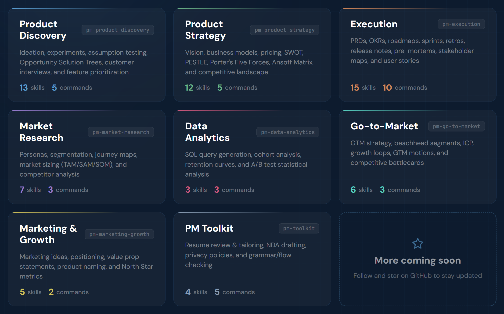

[](https://github.com/phuryn/pm-skills/blob/main/LICENSE)
[](https://github.com/phuryn/pm-skills/blob/main/CONTRIBUTING.md)

# PM 技能库 (PM Skills Library)：跨平台的 AI 产品经理操作系统

> 涵盖 8 大领域、65 项 PM 核心技能和 36 个深度工作流。支持 Cursor、Gemini、Claude Code、Trae 等任何 AI 助手。从产品发现、战略制定、执行管理到市场增长，全方位覆盖。



本仓库提供了一套标准化的 PM 技能定义和工作流。无论你使用哪种 AI 工具，都可以通过引用这些本地文件，让 AI 具备顶级产品经理的专业思维。

## 核心价值

通用的 AI 只给你文字。PM 技能库给你**结构**和**方法论**。

每一项技能都编码了经过验证的 PM 框架——包括 Teresa Torres 的持续发现、Marty Cagan 的产品愿景、以及各种优先级排序模型。通过让 AI 参考这些定义，你将把严谨的产品思维融入日常工作，从而做出更好的产品决策，而不仅仅是生成文档。

## 如何使用

本仓库采用模块化设计，主要包含两个核心部分：

1.  **技能 (Skills)**：位于 `.trae/skills/` 下，是 AI 的“知识插件”。每项技能赋予 AI 特定的领域知识或分析框架（如 `ansoff-matrix`）。
2.  **工作流 (Workflows)**：位于各插件文件夹的 `工作流/` 下（已汉化），是端到端的“操作指南”。它们告诉 AI 如何组合多项技能来解决具体问题（如 `产品发现.md`）。

### 在 AI 助手（Cursor, Trae, Gemini 等）中使用

1.  **克隆仓库**：
    ```bash
    git clone https://github.com/Osirs/pm-skills-sc.git
    ```
2.  **手动引用**：
    在与 AI 对话时，你可以直接提到或上传相关的 `.md` 文件作为参考。
    *   例如：“参考 `01-PM产品探索/工作流/产品发现.md` 这个流程，帮我分析一下我们的新想法。”
    *   或者：“使用 `.trae/skills/product-strategy` 里的框架为我起草一份战略。”

3.  **自动加载（针对支持 Skills 协议的工具）**：
    将对应的技能文件夹复制到工具指定的目录下：
    *   **Gemini CLI**: `~/.gemini/skills/`
    *   **Cursor**: `.cursor/skills/`
    *   **Trae**: `.trae/skills/`

---

## 插件目录

<details>
<summary><strong>1. 01-PM产品探索</strong> — 构思、实验、假设测试、OST（13 项技能，5 个工作流）</summary>

**工作流 (Workflows):**
- `产品发现.md` — 完整的发现周期：构思 → 假设映射 → 优先级排序 → 实验设计
- `头脑风暴.md` — 针对新/旧产品的多视角创意构思
- `用户访谈.md` — 准备访谈提纲或总结记录
- `需求优先级排序.md` — 分析并对功能请求进行科学排序
- `指标设置.md` — 设计产品指标仪表板

</details>

<details>
<summary><strong>2. 02-PM产品战略</strong> — 愿景、业务模式、定价、竞争格局（12 项技能，5 个工作流）</summary>

**工作流 (Commands):**
- `产品战略.md` — 创建完整的 9 章节产品战略画布
- `商业模式.md` — 探索精益画布/创业画布等多种商业模式
- `市场扫描.md` — 宏观环境分析（SWOT + PESTLE + 五力）
- `价值主张.md` — 使用 JTBD 模板设计核心价值主张
- `定价策略.md` — 设计包含竞争分析的定价模型

</details>

<details>
<summary><strong>3. 03-PM执行管理</strong> — PRD、OKR、路线图、冲刺、用户故事（15 项技能，10 个工作流）</summary>

**工作流 (Commands):**
- `编写PRD.md` — 从功能构思创建高质量 PRD
- `规划OKR.md` — 构思与公司目标对齐的团队级 OKR
- `路线图转换.md` — 将功能列表转化为以结果为中心的路线图
- `冲刺管理.md` — 涵盖计划、回顾及发布的全周期管理
- `事前剖析.md` — 进行风险预判和缓解分析
- `会议纪要.md` — 自动提取决策和行动项
- `利益相关者地图.md` — 映射关键人物并创建沟通计划
- `编写用户故事.md` — 将功能分解为 User/Job/WWA 故事
- `测试场景.md` — 生成覆盖正常/边缘情况的测试用例
- `生成模拟数据.md` — 创建真实的测试数据集 (CSV/JSON)

</details>

<details>
<summary><strong>4. 04-PM市场研究</strong> — 画像、细分、旅程图、市场规模（7 项技能，3 个工作流）</summary>

**工作流 (Commands):**
- `用户研究.md` — 构建画像、细分用户并映射客户旅程
- `竞争分析.md` — 深度扫描竞争格局
- `分析用户反馈.md` — 从反馈中提取情感和主题洞察

</details>

<details>
<summary><strong>5. 05-PM数据分析</strong> — SQL 生成、留存分析、A/B 测试（3 项技能，3 个工作流）</summary>

**工作流 (Commands):**
- `编写SQL查询.md` — 自然语言转 SQL (BigQuery, PostgreSQL 等)
- `同期群分析.md` — 留存曲线及参与趋势分析
- `A-B测试分析.md` — 统计显著性校验及发布建议

</details>

<details>
<summary><strong>6. 06-PM进入市场</strong> — 滩头市场、ICP、增长循环、对比表（6 项技能，3 个工作流）</summary>

**工作流 (Commands):**
- `规划产品发布.md` — 从滩头市场到发布计划的完整 GTM 策略
- `增长策略.md` — 设计增长循环并评估进入市场模式
- `竞争对比表.md` — 销售专用的 Battlecard 对比

</details>

<details>
<summary><strong>7. 07-PM营销增长</strong> — 营销创意、定位、北极星指标（5 项技能，2 个工作流）</summary>

**工作流 (Commands):**
- `产品营销.md` — 构思营销方案、定位和产品命名
- `北极星指标.md` — 定义北极星指标及支持性输入指标

</details>

<details>
<summary><strong>8. 08-PM工具箱</strong> — 简历评审、法律文档、校对（4 项技能，5 个工作流）</summary>

**工作流 (Commands):**
- `简历评审.md` — 深度 PM 简历诊断
- `简历定制.md` — 根据特定职位描述优化简历
- `起草NDA.md` — 快速生成保密协议
- `隐私政策.md` — 起草合规的隐私政策
- `文本校对.md` — 检查语法、逻辑和流畅度

</details>

---

## 关于

本项目参考了以下专家的研究成果：
- Teresa Torres — *Continuous Discovery Habits*
- Marty Cagan — *INSPIRED* & *TRANSFORMED*
- Alberto Savoia — *The Right It*
- ...及更多顶级产品专家。

由来自 [The Product Compass Newsletter](https://www.productcompass.pm) 的 Paweł Huryn 策划，并由中文社区持续维护。
